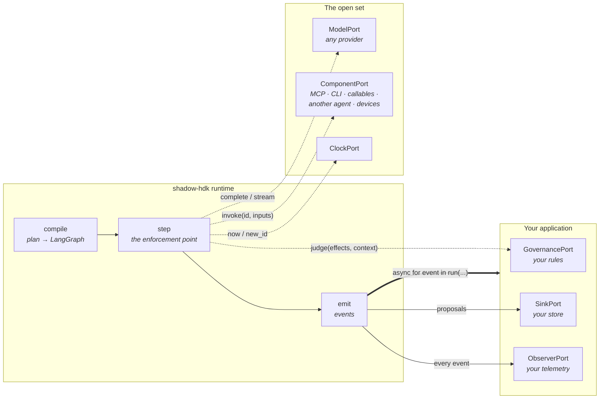
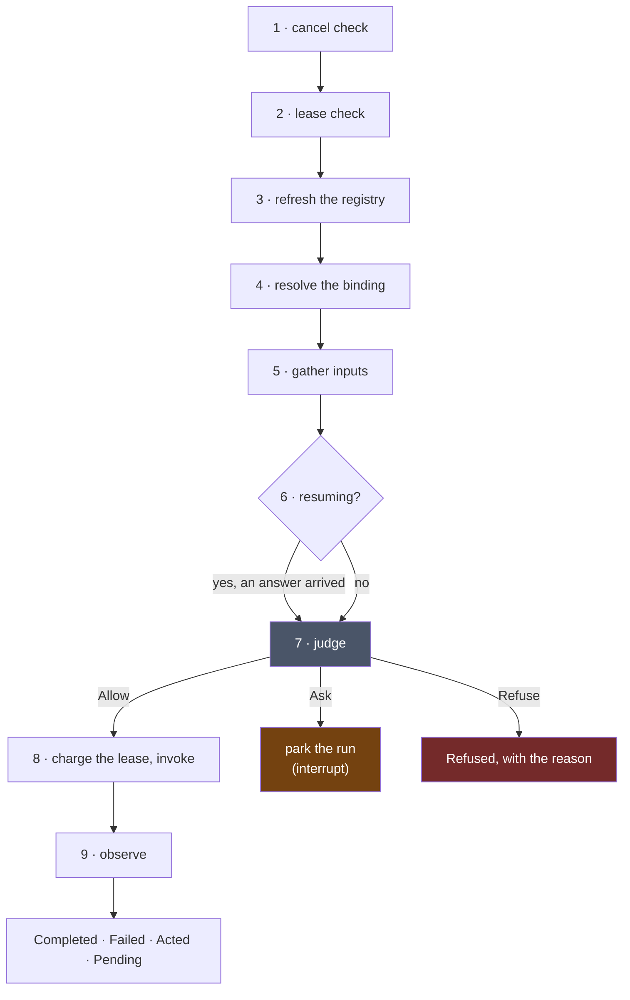
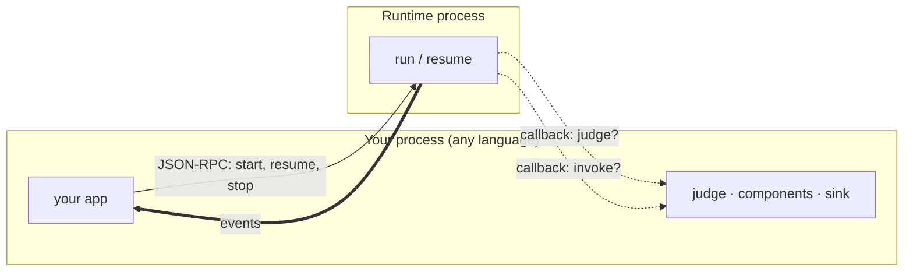

# shadow-hdk

A runtime that runs an agent over an open set of components under a governance policy, and hands
what the agent produces to whoever is listening.

It has no database, no schema, no product concepts and no UI. It does not know what your
application is for. What it knows is how to take a plan, judge every step of it against a policy
before that step runs, act through components, and report what happened as a stream of events —
so that a system built on it can be reasoned about by someone who was not there when it ran.

**Seventeen distributions at `0.16.0`, all MIT.** 949 tests; `mypy --strict` over 147 files;
0.594 ms of runtime overhead per step.

---

## The two rules

Everything else in this repository follows from these.

### 1. Govern effects, not names

A component declares six fields, and every rule downstream is a rule over those six:

```python
EffectProfile(
    reads=frozenset({"filesystem"}),  # what it can see
    writes=frozenset({"filesystem"}),  # what it can change
    reaches=frozenset({"local"}),  # how far it goes
    reversible=False,  # can it be undone
    contained=True,  # is it inside a proven boundary
    costs=Cost(cents=0, seconds=2),  # what it spends
)
```

A policy never sees a tool's *name*. It sees what that tool would do. This is what lets the
registry stay open — an MCP server can add a tool tomorrow and the policy still holds — while the
proof that a mode only ever *narrows* stays finite, because it is a partial order over six fields
rather than over an unbounded set of names.

### 2. Act through components; record through the sink

The runtime has **no write path** into anyone's durable store. When the agent has something worth
keeping, it leaves as a `Proposal` on the sink port and the host decides what to do with it.
Effects on the world go through components, and every component invocation is judged first.

The consequence is that this library can be dropped into a system without owning that system's
data, and a run's whole outward surface is: *events out, proposals out, ports in*.

---

## The shape of a run



The runtime is in the middle and owns nothing on either side. Everything in *Your application* and
everything in *The open set* is a port you implement or an adapter you pick up.

## What one step does

Every step of every composition does the same nine moves in the same order. This is the entire
enforcement story:



Two error classes are load-bearing. A **component** raising, a component that is not registered,
and a binding that refers to nothing are all *data* — a `Failed` observation the agent gets to see
and react to. A **port** raising is a *failure*: the host is broken, and the run ends rather than
reasoning past it.

The charge happens inside the invoke, not at the top, because the lease measures **work** — a step
that was refused before it ran did none.

## The six ports

The port set is open (D22). The first six are what the runtime itself calls; the seventh is the second
**provider** seam (D39) — see *Your key, or your subscription* below.

| Port | You supply | Shipped adapters |
|---|---|---|
| `GovernancePort` | one function: `judge(effects, context) -> Allow \| Ask \| Refuse` | `basic` (allow-all), `modes` (modes and effect rules as data) |
| `ComponentPort` | `registrations()` and `invoke(id, inputs)` | `basic`, `mcp`, `environment`, `acp`, `agent`, `derivation`, `devices`, `mqtt` |
| `ModelPort` | `complete(request)`, optionally `stream` | `langchain` — every provider LangChain integrates |
| `SinkPort` | `propose(proposal)` | `basic` — stdout, a file that survives a crash, a callback |
| `ObserverPort` | `on(event)` | `basic`, `otel` |
| `ClockPort` | `now()`, `new_id()` | `basic`, and a fixed clock for tests |
| `AgentPort` | `open(tools, workspace)` → a resident session | `acp` — Claude Code, OpenCode, anything speaking ACP |

A registry is the **union of every component port, recomputed every step** — so a tool that appears
mid-run is seen, and one that vanishes is gone.

## What comes out

Twelve event kinds, in one ordered stream per run:

`started` · `composed` · `invoked` · `observed` · `proposed` · `refused` · `asked` · `spawned` ·
`spent` · `held` · `reasoned` · `ended`

Six observation kinds, which is what a step's outcome can be:

`Completed` · `Refused` · `Asked` · `Failed` · `Pending` · `Acted`

`Acted` is the receipt of a world-effect: it says the thing happened, and never carries the payload.
`Reasoned` is what the model thought, on the record ahead of what it did — a model that reports no
reasoning emits none.

### The visible agent

Nobody renders twelve raw kinds; every client renders **steps** — what it thought, what it reached
for, what came back, which sub-agent went off and did what, what was refused, what it cost. The
runtime folds the stream into `Step`s once, as a pure function over any event iterable:

```python
from shadow_hdk.runtime.steps import run_steps, steps

async for step in run_steps(run(plan, ports, options=options)):
    print(step.step, step.outcome, step.reasoning[:60], [c.step for c in step.children])
```

Over the wire the same fold sends each step as a `step` notification beside the events, already
folded, so a host in another language renders agent steps without porting the fold.

Two things keep a long run cheap: above `catalogue_threshold` the model sees a name and a line
per tool and pulls a schema with `describe` when it reaches for one; past `offload_over` a large
result reaches the model as a handle, a size and a preview, and `recall` pages the rest. The record
gets the whole thing either way — offloading is about the model's context, never yours.

---

## Using it

### The smallest real thing

```python
from shadow_hdk.adapters.basic import AllowAll, CallableComponents, StdoutSink, SystemClock

from shadow_hdk.kernel import Binding, Ceiling, Composition, EffectProfile, Floor, Invoke, Lease
from shadow_hdk.runtime import Ports, RunOptions, run


def greet(name: str) -> str:
    """Say hello to somebody."""
    return f"hello, {name}"


async def main() -> None:
    tools = CallableComponents()
    tools.add(greet, effects=EffectProfile())  # reads nothing, writes nothing, costs nothing

    ports = Ports(
        model=None,  # no model at all
        components=(tools,),
        governance=AllowAll(),  # your policy goes here
        sink=StdoutSink(),  # your store goes here
        clock=SystemClock(),
    )
    plan = Composition((Invoke("say-hello", "greet", (Binding("name", value="world"),)),))
    options = RunOptions(lease=Lease(Ceiling(max_steps=100, max_wall_seconds=60), Floor(0)))

    async for event in run(plan, ports, options=options):
        print(event.kind, getattr(event, "step", ""))
```

```
started
composed
invoked say-hello
observed say-hello
ended
```

No model is involved. The runtime is a governed workflow engine before it is anything else, and
`run` behaves identically whether the plan came from a person or from a model — the same nine moves,
the same judgement before every step.

> `model=None` runs, but `Ports.model` is typed as required, so a type checker will object. That
> gap is filed as **ENH-004**; making it optional is a contract change, which under D9 moves every
> package together.

### The four public names

```python
from shadow_hdk.runtime import run, resume, current_run, Ports, RunOptions
```

- `run(composition, ports, options=...)` — an async iterator of events.
- `resume(composition, answer, ports, options=...)` — picks a parked run up at the step that asked.
- `current_run()` — how a component proposes, reads what is left of its lease, and spawns children.
- `Ports` / `RunOptions` — what you hand in.

### Choosing what kind of agent

An agent architecture is **data**, not a code path. Six patterns ship as TOML in the `agent`
adapter's `library/` directory:

`single` · `plan-and-execute` · `orchestrator-workers` · `critic-pair` · `reflect-until` ·
`keeps-helpers`

```python
single = Pattern("single", ROLE, meta_tools=frozenset({"propose", "done"}))
```

`single` offers the model no `compose` meta-tool, so it cannot change its own shape — a
deterministic one-agent product running on the same runtime a fully dynamic one uses. A team writes
a new pattern by writing a TOML file, not by writing Python.

### Consuming it from a product

You implement the ports; the runtime enforces. The division is deliberate and it is the whole
integration story:

| The runtime owns | Your product owns |
|---|---|
| Compiling a plan and running it | What the plan is *about* |
| Calling `judge` before every step | What `judge` decides |
| Emitting the event stream | Rendering it, storing it, streaming it to a browser |
| Handing you proposals | Your database, your schema, your migrations |
| Carving a child's lease from its parent's | What a lease costs and who pays |
| Parking a run that must ask | Who gets asked, and how |

Two ways in:

- **In-process** — import `shadow_hdk.runtime` and hold the ports yourself. This is the normal
  case.
- **Over a wire** — `shadow_hdk.wire` puts the runtime behind a JSON-RPC listener and *inverts*
  the ports: the runtime runs in one process, your `judge`, your components and your sink stay in
  yours, and it calls back across the connection (D21). This is how a host in another language, or
  on another machine, drives it. `--stdio` drives a child process instead of a socket.



### Your key, or your subscription

Two ways to pay for the thinking, and the harness governs both the same way.

**Bring your own key.** A `ModelPort` — `LangChainModel` reaches OpenAI and every OpenAI-compatible
endpoint, Anthropic, Ollama, Bedrock, Vertex, Mistral. Your loop, your patterns, your tools.

**Bring your own subscription.** Many people already pay for a coding agent — Claude Code, OpenCode,
Codex — and that is inference already bought. An `AgentPort` drives one that is already installed and
already signed in:

```python
from shadow_hdk.providers import detect, open_with, shipped

found = await detect(list(shipped().values()))
for it in found:
    print(it.provider.called, it.status, it.version or "", it.install_hint if not it.usable else "")
# Claude Code  ready  2.1.235
# OpenCode     ready  1.18.21
```

Three things that follow, and they are the whole design:

- **No credential is ever read, stored, forwarded or logged** (D41). The provider is *asked* its own
  status question. There is nothing to leak because nothing is held. Five answers, and `unknown`
  means nobody could ask — not that the answer was no.
- **Nothing is ever installed.** An absent provider is reported with the command that would fix it.
- **Its loop, our tools** (D42). The provider is launched with the run's own registry as its tool
  source and its native tools refused, so every file it writes and every command it runs arrives as
  a step on our graph — judged on effects, charged to the lease, on the event stream. It reasons;
  we govern.

A provider is **data** (D40): one TOML file, the same way patterns are. Adding one costs a file, not
a phase — `opencode` was added without a line of Python. And the selection surface imports no
adapter: transports declare themselves through entry points, so a third party can ship one this
repository has never heard of.

The trade, stated plainly: when a subscription drives, **its** loop runs, not ours — our patterns
and compositions do not apply (D43). You cannot buy an agent and also own its loop. If you need our
loop, that is what `ModelPort` is for.

### Where effects land — the environment

One environment with a mode, and the confinement is the operating system's (D48, D49):

```python
from shadow_hdk.adapters.environment import LocalEnvironment

env = await LocalEnvironment.open(Path("./work"), mode="workspace-write")
# proven before it exists: a write outside ./work is denied, a socket is denied, a write inside
# works — by sandbox-exec on macOS, bubblewrap on Linux. Every operation's effect profile is
# derived once from what that proof found. A mode this machine cannot enforce is refused, never
# quietly widened; `full` always works and declares everything.
```

`SandboxEnvironment` is the same six operations in a box somebody else built — OpenSandbox first —
proven by two denials (D50).

### Running the examples

```bash
uv run python examples/bare.py            # the harness on its own, with no product and no network
uv run python -m examples.coder ./work    # a coding agent on your subscription, governed by us
uv run python -m examples.host "brief"    # a host: its own policy, ledger, store and view handed in
uv run python -m examples.studio ./work   # the same, with a page: steps, questions, files — live
```

[`examples/coder`](examples/coder/README.md) is the one to read if you want to see all of this at
once. Your subscription does the reasoning; its own file and shell tools are **refused** and the
run's registry is handed to it instead, so every file it writes and every command it runs arrives
as a step on our graph:

```
  · write_file
    → Completed(output={'path': 'primes.py', 'bytes': 416})
  · run_shell
    → Completed(output={'exit_code': 0, 'stdout': '2 3 5 7 11 13 17 19 23 29 31 37\n'})
```

Swap the mode from `BUILDING` to `LOOKING` and ask again, and you get `✕ refused: mode 'looking'
does not permit this` — from a policy that has never heard of `write_file`.

[`examples/studio`](examples/studio/__init__.py) is the one to *watch*: a page over the same
conversation, showing the record as it happens — every step, the reasoning ahead of it, the
environment's answers, an **Allow / Refuse** box when the policy asks (answered while the provider
waits on the call, D58), and the workspace's files as they change. Run it in `--mode=full` to see
the questions; in `workspace-write` the sandbox confines writes and nothing needs asking.

`examples/bare.py` is the test that defines done: a composition running against a component that
arrived from outside, a model and a sub-agent, governed by allow-all, everything written to stdout —
with **zero lines of any application's code**. `examples/real.py` does the same over real adapters.

[`examples/host`](examples/host/__init__.py) is the shape every product takes: a program that hands
the runtime **its own** `GovernancePort` (a judgement over effects — reads anywhere, writes in the
workspace, a write outside is a *question*, the network refused), its own `SinkPort` (a ledger of
proposals), a LangGraph checkpointer on a file, and its own view of the projection — every step as
it closes, what was thought before it, what it cost — then runs a brief through whichever brain it
has: a scripted model (free), a model **by key** (`--brain=key`, any provider LangChain integrates)
or the CLI signed in on this machine (`--brain=subscription`). A question the host cannot answer
now parks the run in the store, and the next call resumes it. **Skills are a registry** the host
offers as a component: shipped ones (four, none about code), the host's kept ones, and what the
run mints — a name and a line each until chosen; choosing is a step on the record; a minted skill
is proposed through the sink and the host decides whether to keep it. Measured live on Claude
Code:

```
∴ I need to list the workspace files and write them into INDEX.md, so I'll load the schemas …
  ✓ list_dir → Completed(output=['a.txt'], kind='completed')
∴ Since there's only a.txt present and INDEX.md doesn't exist yet, I'll just list a.txt …
  ✓ write_file → Completed(output={'path': 'INDEX.md', 'bytes': 6}, kind='completed')
✓ resident → Completed(output={'text': "The workspace contained one file, `a.txt`. …
```

---

## Layout

Seventeen distributions, one import name (`shadow_hdk`, a namespace package), so a deployment
takes only what it uses.

```
packages/kernel                     pure types, one partial order, six ports — no I/O at all
packages/runtime                    the loop, on LangGraph
packages/wire                       the runtime behind JSON-RPC, ports inverted
packages/providers                  what this machine can reach — your key, or your subscription
packages/adapters/basic             allow-all · stdout · file · clock · callables
packages/adapters/modes             governance as data: a mode is a ceiling and an ask line
packages/adapters/agent             the model loop as a component; patterns and skills as TOML
packages/adapters/langchain         one ModelPort over every provider LangChain integrates
packages/adapters/mcp               an MCP server's tools as components, effects derived not trusted
packages/adapters/acp               another agent (Codex, Claude Code) as a governed component
packages/adapters/recording         this run's registry, offered to a child as an MCP server
packages/adapters/workspace         a filesystem confined to a root it cannot leave
packages/adapters/sandbox_subprocess  code with a leash, and an honest account of what it is not
packages/adapters/contained         a sandbox that proves containment or refuses to exist
packages/adapters/derivation        total expressions over typed tables, fixed-point arithmetic
packages/adapters/devices           sensors, actuators, witnesses — one device contract
packages/adapters/mqtt              MQTT topics over that device contract
packages/adapters/otel              the shape of a run as a trace, over the OpenTelemetry API alone
```

### The invariants

These fail the build rather than a review, because a convention nobody can run is a convention that
has already drifted. They live in `tests/invariants/`:

| Invariant | What it refuses |
|---|---|
| stands alone | the kernel importing I/O, a clock, logging or a framework; the runtime importing an adapter; **any adapter importing another**; the selection surface importing any |
| the gate covers every package | a package quietly outside lint, types or tests — this repository shipped nine type errors that way once |
| a wheel carries what it needs | a distribution that installs but cannot import |
| every port is held to its contract | a new port implementation with no contract suite and no recorded reason |
| the decisions index is true | the map of D1–D50 drifting from the decisions |
| the documents describe this tree | a document naming a path that does not exist, or a listing that no longer matches the directory it describes |

The last one is why this file names only paths that are really here.

---

## Building it

```bash
uv sync --all-packages
uv run ruff check
uv run ruff format --check
uv run mypy
uv run pytest
```

All four must exit zero. CI runs them on every push. The **live** proofs — real providers, real
money or a subscription seat — are opt-in and never run on a push: locally with
`uv run pytest -m live -rs` (a provider that is absent or signed out *skips*, and `-rs` says why),
or on demand with `gh workflow run live.yml`.

## Status

Phases 0–24 are complete, merged and released; `specs/status.md` is the live record and
`specs/planning/roadmap.md` the plan. The backlog holds no P0, P1 or P2.

**What is deliberately not proven here**, because each needs something a laptop does not have:
the live gVisor and Firecracker containment proofs (a Linux host — the backends refuse to exist
unless containment is proven, so they *skip* rather than pass), TLS on the MQTT link (a TLS broker),
a second protocol adapter such as OPC-UA or ROS 2 (a server, a distribution), and unit cancellation
in the derivation engine (a recorded design deferral). Two governance questions — whether an
irreversible step must produce an `Acted` whichever port it came through, and which effects must be
signed — are open decisions rather than missing code.

The low-level design is in [`specs/architecture/overview.md`](specs/architecture/overview.md); the
thirty-eight decisions behind it are mapped in
[`specs/decisions/index.md`](specs/decisions/index.md).

MIT.
