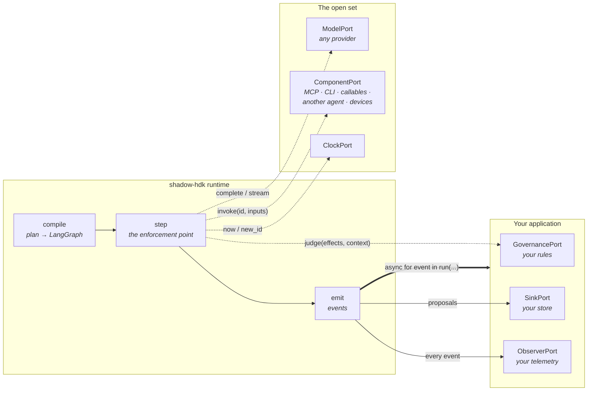
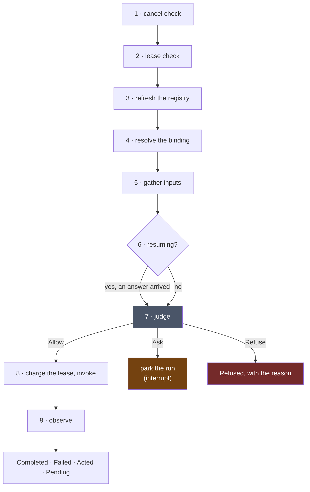
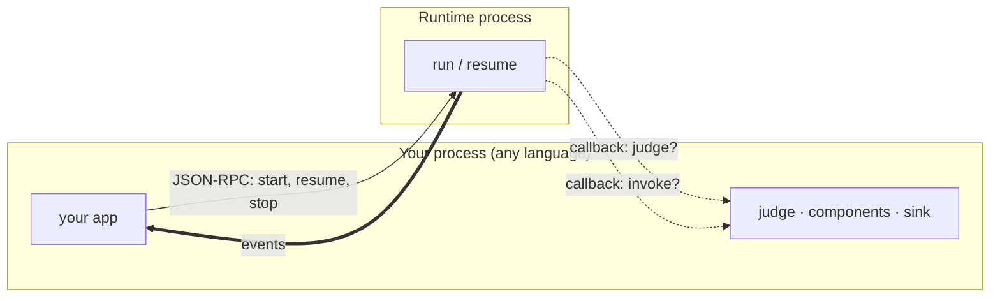

# Shadow HDK

**A Harness Development Kit**: a runtime that runs an agent over an open set of components under
a governance policy and hands what the agent produces to whoever is listening — the kit a team
builds its own agentic system from. `pip install shadow-hdk`; `from shadow_hdk.serve import
Harness`; `shadow-hdk serve`.

It has no database, no schema, no product concepts and no UI. It does not know what your
application is for. What it knows is how to take a plan, judge every step of it against a policy
before that step runs, act through components, and report what happened as a stream of events —
so that a system built on it can be reasoned about by someone who was not there when it ran.

**One distribution, `shadow-hdk` `0.29.0`, MIT, on PyPI.** 1,560 tests; `mypy --strict` over 418 files;
0.594 ms of runtime overhead per step.

---

## The two rules

Everything else in this repository follows from these.

### 1. Govern effects, not names

A component declares six fields, and every rule downstream is a rule over those six:

```python
from shadow_hdk.kernel import EffectProfile, ScopeSet

EffectProfile(
    reads=ScopeSet.of("workspace"),  # what it can see
    writes=ScopeSet.of("workspace"),  # what it can change
    reaches=False,  # does it leave this machine
    reversible=False,  # can it be undone
    contained=True,  # is it inside a proven boundary
    costs=False,  # does it spend money
)
```

A policy never sees a tool's *name*. It sees what that tool would do. This is what lets the
registry stay open — an MCP server can add a tool tomorrow and the policy still holds — while the
proof that a mode only ever *narrows* stays finite, because it is a partial order over six fields
rather than over an unbounded set of names.

### 2. Act through components; record through the sink

The runtime has **no write path** into anyone's durable store. When the agent has something worth
keeping, it leaves as a `Proposal` on the sink port and the host decides what to do with it.
Effects on the world go through components, and every component invocation is judged first.

The consequence is that this library can be dropped into a system without owning that system's
data, and a run's whole outward surface is: *events out, proposals out, ports in*.

---

## The shape of a run



The runtime is in the middle and owns nothing on either side. Everything in *Your application* and
everything in *The open set* is a port you implement or an adapter you pick up.

## What one step does

Every step of every composition does the same nine moves in the same order. This is the entire
enforcement story:



Two error classes are load-bearing. A **component** raising, a component that is not registered,
and a binding that refers to nothing are all *data* — a `Failed` observation the agent gets to see
and react to. A **port** raising is a *failure*: the host is broken, and the run ends rather than
reasoning past it.

The charge happens inside the invoke, not at the top, because the lease measures **work** — a step
that was refused before it ran did none.

## The ports

The port set is open (D22). The first six are what the runtime itself calls in a run; the
seventh is the second **provider** seam (D39) — see *Your key, or your subscription* below; the
last two are what a *thread* and the *registries* keep their state in (D62, D66).

| Port | You supply | Shipped adapters |
|---|---|---|
| `GovernancePort` | one function: `judge(effects, context) -> Allow \| Ask \| Refuse` | `basic` (allow-all), `modes` (modes and effect rules as data) |
| `ComponentPort` | `registrations()` and `invoke(id, inputs)` | `basic`, `mcp`, `environment`, `acp`, `agent`, `derivation`, `devices`, `mqtt` |
| `ModelPort` | `complete(request)`, optionally `stream` | `langchain` — every provider LangChain integrates |
| `SinkPort` | `propose(proposal)` | `basic` — stdout, a file that survives a crash, a callback |
| `ObserverPort` | `on(event)` | `basic`, `otel` |
| `ClockPort` | `now()`, `new_id()` | `basic`, and a fixed clock for tests |
| `AgentPort` | `open(tools, workspace, behaviour, resume)` → a resident session | `jsonl` — Claude Code, Codex; `acp` — OpenCode, anything speaking ACP |
| `ThreadStore` | `create`, `save`, `get`, `list` a thread record (the shipped ones also `archive`) | `runtime` (memory), `basic` (sqlite) |
| `Store` | `put`, `get`, `delete`, `list`, `version` on a collection of JSON rows | `runtime` (memory), `basic` (sqlite); yours behind your database |

A registry is the **union of every component port, recomputed every step** — so a tool that appears
mid-run is seen, and one that vanishes is gone.

## What comes out

Fifteen event kinds, in one ordered stream per run — the record, complete and replayable:

`started` · `composed` · `invoked` · `observed` · `proposed` · `refused` · `approval_requested` ·
`input_requested` · `spawned` · `usage` · `held` · `reasoning` · `mode_changed` · `workspace_changed` ·
`ended`

Seven observation kinds, which is what a step's outcome can be:

`Completed` · `Refused` · `ApprovalRequest` · `InputRequest` · `Failed` · `Pending` · `Acted`

`Acted` is the receipt of a world-effect: it says the thing happened, and never carries the payload.
`reasoning` is what the model thought, on the record ahead of what it did — a model that reports no
reasoning emits none. Beside the record runs **activity** — partial thinking, partial text, a
running command's output — live, bounded, never checkpointed: the record is complete, the activity
is live.

### The host's vocabulary — Thread · Turn · Item · Activity

The words are the industry's. A **thread** is the container every product has (Codex's thread,
Claude Code's session): the provider opened once and held, its record kept through a `ThreadStore`
you implement or take as shipped (sqlite), resumable, forkable, listable. A **turn** is one
exchange — one run of the thread, under a ceiling carved from the thread's lease. An **item** is
what you render: a fold of the events into what the agent thought, reached for, got back, spawned,
was refused, asked and spent, each tool call a child item under the turn. **Activity** is the
stream beside it.

```python
from shadow_hdk.runtime.threads import Thread

thread = await Thread.open(agent=provider, ports=ports, store=store, root=".", lease=lease)
async for event in thread.turn("add a .gitignore and run the tests"):
    ...  # the record, as it happens
await thread.set_mode("read-only")  # policy and behaviour, switched live
```

Nobody renders fifteen raw kinds; the runtime folds them into `Item`s once, as a pure function
over any event iterable (`runtime.items`), and the wire sends each item as an `item` notification
beside the events, so a host in another language renders agent steps without porting the fold.

### Modes, approvals, rules — and the store

A **mode** is a policy (what runs, what asks, what is refused — judged by *effects*), a behaviour
(who the model is: role, model, effort, temperature, which tools are offered) and a presentation
(id, name, description), and it names the **environment mode** it needs — what the sandbox must
enforce — so switching a mode switches the sandbox too (D76). Four ship — `read-only`, `ask`
(the workspace is the ceiling and every change inside it is asked about: the mode every coding
CLI opens in), `workspace-write`, `full` — and yours are files (`modes/reviewer.md`, frontmatter
and a prompt) or rows in the **store**. A mode change reopens the provider on its own session,
so a resident CLI lists the new mode's tools and keeps its memory. When the policy asks, the
host answers through its `Approvals` handle: **approve**, **deny**, or **approve and add a rule** —
an `ActRule` naming the act, kept, read at the next judgement, on the record as a proposal. The
agent's own question to the person is `ask_person`, an `InputRequest` on the record.

Everything a product would keep in a database — modes, rules, skills, which tools and batteries
are on, providers — is a registry with a `Store` source: change a row, and the next step reads
it. Only the substrate (contracts, the loop, ports, adapters, transports) is code. **The record
chooses its store** (D79): `[store] url = "sqlite:///live.sqlite"` or `"postgresql://…"` fills
the store, the threads and the checkpointer at once, so a turn parked on a question outlives the
process that asked it (D80); a thread has one holder at a time (D81), is opened for a principal
whose rules and modes are scoped to them (D82), on a budget kept on its record (D84); a `deny`
or an `ask` rule holds in every mode, `full` included (D85). **A product owns what it owns**
(Phase 30): the governed turn without the record (`Conversation`, D87), a question a turn parks
on purpose for a later request (D88), an agent that streams (D89), tokens on the record (D90),
the contract suites shipped so a product proves its own stores (D91), governance composed by
routing and refusals a client can switch on (D92), a parked run behind a port of ours (D93),
sessions that idle out and a stream that survives a drop (D94) — the guide is
[`docs/consuming.md`](docs/consuming.md).

Two things keep a long run cheap: above `catalogue_threshold` the model sees a name and a line
per tool and pulls a schema with `describe` when it reaches for one; past `offload_over` a large
result reaches the model as a handle, a size and a preview, and `recall` pages the rest. The record
gets the whole thing either way — offloading is about the model's context, never yours.

---

## Using it

### Install

```bash
pip install shadow-hdk            # the kit: kernel, runtime, wire, providers, serve, the light adapters
pip install "shadow-hdk[all]"     # …and every specialised SDK
```

One distribution, one import name (`shadow_hdk`), one CLI (`shadow-hdk`). What a base install
does not need it does not pay for — the specialised SDKs are extras, each behind the part that
uses it, and a part that needs one says which when it is missing:

| extra | brings | for |
|---|---|---|
| `[langchain]` | LangChain | the model port over every provider LangChain integrates — bring your own key |
| `[openai]` `[anthropic]` `[ollama]` `[huggingface]` | that provider's LangChain package (each includes `[langchain]`) | one provider |
| `[mqtt]` | paho-mqtt | devices over MQTT 3.1.1 |
| `[otel]` | opentelemetry-api | the event stream as a trace |
| `[sandbox]` | the OpenSandbox SDK | an environment inside a box somebody else built |
| `[search]` | ddgs | the light web-search battery's engine (wigolo is its own process, via npm) |
| `[all]` | all of the above | |

The layering — the kernel pure, the runtime importing no adapter, no adapter importing another,
the wire and the providers importing no adapter — is a test, not a packaging boundary (D78).

### Three lines

Simple by default, deep by choice (D71). A product that wants defaults writes a `harness.toml`
and three lines; every port underneath is what it always was, and one step deeper is the same
objects.

```toml
# harness.toml
[environment]
root = "."
mode = "workspace-write"     # read-only · ask · workspace-write · full · a mode of your own (a file or a row)

[provider]
want = "claude-code"         # or codex · opencode — whichever is signed in here; omit for the first found

[tools]
batteries = ["wigolo"]       # web_search · web_fetch, consumed as an MCP server (D70)

[budget]
steps = 400
seconds = 3600
cents = 500
```

```python
from shadow_hdk.serve import Harness

async with Harness.load("harness.toml") as h:
    async for part in h.turn("add a .gitignore and run the tests"):
        print(part.kind, part.item.component if part.item else "")
    print(h.thread.record.turns[-1].text)
```

`turn()` yields every part of what happens, in order: the record's events by their own kind,
`activity` beside them (thinking and text as they stream, a command's output as it prints),
`item` as each step folds closed, and `turn` — last — with the record. `Harness(root, mode=…,
batteries=…, budget=…)` is the file without the file; `governance=`, `sink=`, `observer=`,
`agent=` hand your own port in for the shipped one; `h.thread`, `h.approvals`, `h.modes`,
`h.rules`, `h.store` are the objects underneath. Two invariants hold the promise: the facade
reaches only public names, and every key in the file maps to a port or a profile. The same file
serves a host in any language: `shadow-hdk serve harness.toml --stdio|--http`.

### The smallest real thing

```python
from shadow_hdk.adapters.basic import AllowAll, CallableComponents, StdoutSink, SystemClock

from shadow_hdk.kernel import Binding, Ceiling, Composition, EffectProfile, Floor, Invoke, Lease
from shadow_hdk.runtime import Ports, RunOptions, run


def greet(name: str) -> str:
    """Say hello to somebody."""
    return f"hello, {name}"


async def main() -> None:
    tools = CallableComponents()
    tools.add(greet, effects=EffectProfile())  # reads nothing, writes nothing, costs nothing

    ports = Ports(
        model=None,  # no model at all
        components=(tools,),
        governance=AllowAll(),  # your policy goes here
        sink=StdoutSink(),  # your store goes here
        clock=SystemClock(),
    )
    plan = Composition((Invoke("say-hello", "greet", (Binding("name", value="world"),)),))
    options = RunOptions(lease=Lease(Ceiling(max_steps=100, max_wall_seconds=60), Floor(0)))

    async for event in run(plan, ports, options=options):
        print(event.kind, getattr(event, "step", ""))
```

```
started
composed
invoked say-hello
observed say-hello
ended
```

No model is involved. The runtime is a governed workflow engine before it is anything else, and
`run` behaves identically whether the plan came from a person or from a model — the same nine moves,
the same judgement before every step.

> `model=None` runs, but `Ports.model` is typed as required, so a type checker will object. That
> gap is filed as **ENH-004**; making it optional is a contract change, which under D9 moves every
> package together.

### The four public names

```python
from shadow_hdk.runtime import run, resume, current_run, Ports, RunOptions
```

- `run(composition, ports, options=...)` — an async iterator of events.
- `resume(composition, answer, ports, options=...)` — picks a parked run up at the step that asked.
- `current_run()` — how a component proposes, reads what is left of its lease, and spawns children.
- `Ports` / `RunOptions` — what you hand in.

### Choosing what kind of agent

An agent architecture is **data**, not a code path. Six patterns ship as TOML in the `agent`
adapter's `library/` directory:

`single` · `plan-and-execute` · `orchestrator-workers` · `critic-pair` · `reflect-until` ·
`keeps-helpers`

```python
single = Pattern("single", ROLE, meta_tools=frozenset({"propose", "done"}))
```

`single` offers the model no `compose` meta-tool, so it cannot change its own shape — a
deterministic one-agent product running on the same runtime a fully dynamic one uses. A team writes
a new pattern by writing a TOML file, not by writing Python.

### Consuming it from a product

You implement the ports; the runtime enforces. The division is deliberate and it is the whole
integration story:

| The runtime owns | Your product owns |
|---|---|
| Compiling a plan and running it | What the plan is *about* |
| Calling `judge` before every step | What `judge` decides |
| Emitting the event stream | Rendering it, storing it, streaming it to a browser |
| Handing you proposals | Your database, your schema, your migrations |
| Carving a child's lease from its parent's | What a lease costs and who pays |
| Parking a run that must ask | Who gets asked, and how |

Two ways in:

- **In-process** — import `shadow_hdk.runtime` and hold the ports yourself. This is the normal
  case.
- **Over a wire** — `shadow_hdk.wire` puts the runtime behind a JSON-RPC listener and *inverts*
  the ports: the runtime runs in one process, your `judge`, your components and your sink stay in
  yours, and it calls back across the connection (D21). This is how a host in another language, or
  on another machine, drives it. `--stdio` drives a child process instead of a socket.



### A host in any language

The wire's second shape (D67) keeps the ports **runtime-side** — the shipped composition, a store,
the provider signed in here — and a host across it drives *threads* by method, the way Codex's app
server is driven. `shadow-hdk serve` runs it:

```
shadow-hdk serve harness.toml --stdio                     # newline-delimited JSON-RPC on a pipe
shadow-hdk serve harness.toml --http --port 8765          # loopback listener, SSE for the way back
shadow-hdk serve --http --page examples/studio/page.html --root ./work --mode workspace-write
```

Over `--http` a client opens the session with `GET /rpc` (an SSE stream; the session id comes
back in `x-shadow-hdk-session`) and posts JSON-RPC frames to `POST /rpc` with that header. The
methods: `thread/start` · `thread/resume` · `thread/close` · `thread/list` · `thread/fork` ·
`thread/rollback` · `thread/archive` · `thread/set_mode` · `thread/set_option` ·
`thread/remaining` · `turn/start` · `turn/steer` · `turn/interrupt` · `approvals/pending` ·
`approvals/answer` · `run/cancel` · `store/put|get|delete|list|version` · `modes/list` ·
`rules/list` · `files/list` · `files/read` · `batteries/list` · `tools/list` (what the agent is
offered now, each with the mode's judgement) · `skills/list` · `thread/add_root`. Down the stream, tagged with the thread: `event`,
`item` (folded runtime-side, D46), `activity` (D63), `approval_request`, `input_request`,
`request_withdrawn`; `turn/start` returns the turn's record when it ends. An invariant holds
every public method of `Thread`, `Approvals` and `Store` to a name in `protocol.py`.

`clients/typescript/` is the proof in another language — types generated from the published
schemas (D68) and a thin client, driven against a live `serve --http` by the test suite:

```ts
import { HarnessClient } from "shadow-hdk-client";

const client = new HarnessClient({ address: "http://127.0.0.1:8765" });
await client.connect();
const started = await client.thread.start({}); // root and mode from harness.toml; or pass them
client.approvals.onRequest((request) => client.approvals.answer(request.handle, { kind: "approve" }));
for await (const line of client.turn.start(started.thread_id, "hello from typescript")) {
  if (line.kind === "item") console.log(line.item.step, line.item.outcome);
  if (line.kind === "activity") process.stdout.write(line.activity.text);
  if (line.kind === "done") console.log(line.turn.text);
}
```

The studio (`examples/studio/`) is a page `serve` itself serves, talking exactly these methods and
nothing local (D69) — what the page does, a product in any language does the same way.

### Your key, or your subscription

Two ways to pay for the thinking, and the harness governs both the same way.

**Bring your own key.** A `ModelPort` — `LangChainModel` reaches OpenAI and every OpenAI-compatible
endpoint, Anthropic, Ollama, Bedrock, Vertex, Mistral. Your loop, your patterns, your tools.

**Bring your own subscription.** Many people already pay for a coding agent — Claude Code, OpenCode,
Codex — and that is inference already bought. An `AgentPort` drives one that is already installed and
already signed in:

```python
from shadow_hdk.providers import detect, open_with, shipped

found = await detect(list(shipped().values()))
for it in found:
    print(it.provider.called, it.status, it.version or "", it.install_hint if not it.usable else "")
# Claude Code  ready  2.1.235
# OpenCode     ready  1.18.21
```

Three things that follow, and they are the whole design:

- **No credential is ever read, stored, forwarded or logged** (D41). The provider is *asked* its own
  status question. There is nothing to leak because nothing is held. Five answers, and `unknown`
  means nobody could ask — not that the answer was no.
- **Nothing is ever installed.** An absent provider is reported with the command that would fix it.
- **Its loop, our tools** (D42). The provider is launched with the run's own registry as its tool
  source and its native tools refused, so every file it writes and every command it runs arrives as
  a step on our graph — judged on effects, charged to the lease, on the event stream. It reasons;
  we govern.

A provider is **data** (D40): one TOML file, the same way patterns are. Adding one costs a file, not
a phase — `opencode` was added without a line of Python. And the selection surface imports no
adapter: transports declare themselves through entry points, so a third party can ship one this
repository has never heard of.

The trade, stated plainly: when a subscription drives, **its** loop runs, not ours — our patterns
and compositions do not apply (D43). You cannot buy an agent and also own its loop. If you need our
loop, that is what `ModelPort` is for.

### Where effects land — the environment

One environment with a mode, and the confinement is the operating system's (D48, D49):

```python
from shadow_hdk.adapters.environment import LocalEnvironment

env = await LocalEnvironment.open(Path("./work"), mode="workspace-write")
# proven before it exists: a write outside ./work is denied, a socket is denied, a write inside
# works — by sandbox-exec on macOS, bubblewrap on Linux. Every operation's effect profile is
# derived once from what that proof found. A mode this machine cannot enforce is refused, never
# quietly widened; `full` always works and declares everything.
```

`SandboxEnvironment` is the same six operations in a box somebody else built — OpenSandbox first —
proven by two denials (D50).

A **workspace is one or many roots** (D76) — the primary, where a relative path resolves, and
the rest addressed by name (`sales/notes.md`), the shape of VS Code's multi-root, Claude Code's
`--add-dir` and Codex's `writable_roots`:

```python
from shadow_hdk.kernel import Root, Workspace

env = await LocalEnvironment.open(
    workspace=Workspace((Root("finance", "./finance"), Root("sales", "./sales"))),
    mode="workspace-write",
)
# the profile allows writes under every root; the proof writes inside each and outside all
await env.reopen(workspace=env.workspace.with_root(Root("hr", "./hr")))  # proven again
```

A thread names its roots at `thread/start {roots: [{name, path}, …]}` and grows them with
`thread/add_root` while it runs; `files/list` says each file's root. `Thread.tools()` says what
the agent is offered *now* — every registration with the mode's judgement — and `tools/list`
crosses it.

### Running the examples

```bash
uv run python examples/bare.py            # the harness on its own, with no product and no network
uv run python -m examples.coder ./work    # a coding agent on your subscription, governed by us
uv run python -m examples.host "brief"    # a host: its own policy, ledger, store and view handed in
uv run python -m examples.studio ./work   # the same, with a page: steps, questions, files — live
```

[`examples/coder`](examples/coder/README.md) is the one to read if you want to see all of this at
once. Your subscription does the reasoning; its own file and shell tools are **refused** and the
run's registry is handed to it instead, so every file it writes and every command it runs arrives
as a step on our graph:

```
  · write_file
    → Completed(output={'path': 'primes.py', 'bytes': 416})
  · run_shell
    → Completed(output={'exit_code': 0, 'stdout': '2 3 5 7 11 13 17 19 23 29 31 37\n'})
```

Swap the mode from `BUILDING` to `LOOKING` and ask again, and you get `✕ refused: mode 'looking'
does not permit this` — from a policy that has never heard of `write_file`.

[`examples/studio`](examples/studio/__init__.py) is the one to *watch*: a page over the same
conversation, showing the record as it happens — every step, the reasoning ahead of it, the
environment's answers, an **Allow / Refuse** box when the policy asks (answered while the provider
waits on the call, D58), and the workspace's files as they change. Run it in `--mode=full` to see
the questions; in `workspace-write` the sandbox confines writes and nothing needs asking.

`examples/bare.py` is the test that defines done: a composition running against a component that
arrived from outside, a model and a sub-agent, governed by allow-all, everything written to stdout —
with **zero lines of any application's code**. `examples/real.py` does the same over real adapters.

[`examples/host`](examples/host/__init__.py) is the shape every product takes: a program that hands
the runtime **its own** `GovernancePort` (a judgement over effects — reads anywhere, writes in the
workspace, a write outside is a *question*, the network refused), its own `SinkPort` (a ledger of
proposals), a LangGraph checkpointer on a file, and its own view of the projection — every step as
it closes, what was thought before it, what it cost — then runs a brief through whichever brain it
has: a scripted model (free), a model **by key** (`--brain=key`, any provider LangChain integrates)
or the CLI signed in on this machine (`--brain=subscription`). A question the host cannot answer
now parks the run in the store, and the next call resumes it. **Skills are a registry** the host
offers as a component: shipped ones (four, none about code), the host's kept ones, and what the
run mints — a name and a line each until chosen; choosing is a step on the record; a minted skill
is proposed through the sink and the host decides whether to keep it. Measured live on Claude
Code:

```
∴ I need to list the workspace files and write them into INDEX.md, so I'll load the schemas …
  ✓ list_dir → Completed(output=['a.txt'], kind='completed')
∴ Since there's only a.txt present and INDEX.md doesn't exist yet, I'll just list a.txt …
  ✓ write_file → Completed(output={'path': 'INDEX.md', 'bytes': 6}, kind='completed')
✓ resident → Completed(output={'text': "The workspace contained one file, `a.txt`. …
```

---

## Layout

One distribution, one import name (`shadow_hdk`), the specialised SDKs as extras — and one
TypeScript client generated from the schemas.

```
src/shadow_hdk/kernel               pure types, one partial order, the ports — no I/O at all
src/shadow_hdk/runtime              the loop, on LangGraph; threads; the environment base
src/shadow_hdk/wire                 the runtime behind JSON-RPC — ports inverted, or threads served
src/shadow_hdk/serve                the front door: `Harness`, `shadow-hdk serve`, batteries
src/shadow_hdk/providers            what this machine can reach — your key, or your subscription
src/shadow_hdk/adapters/basic       allow-all · stdout · file · clock · callables · sqlite stores
src/shadow_hdk/adapters/modes       governance as data: a mode is a policy, a behaviour, an environment
src/shadow_hdk/adapters/agent       the model loop as a component; patterns and skills as TOML
src/shadow_hdk/adapters/langchain   one ModelPort over every provider LangChain integrates  [langchain]
src/shadow_hdk/adapters/mcp         an MCP server's tools as components, effects derived not trusted
src/shadow_hdk/adapters/acp         an agent over ACP — OpenCode, anything Zed-compatible
src/shadow_hdk/adapters/jsonl       a CLI answering in line-delimited JSON — Claude Code, Codex
src/shadow_hdk/adapters/recording   this run's registry, offered to a child as an MCP server
src/shadow_hdk/adapters/environment where effects land, with a mode, on one or many roots  [sandbox]
src/shadow_hdk/adapters/derivation  total expressions over typed tables, fixed-point arithmetic
src/shadow_hdk/adapters/devices     sensors, actuators, witnesses — one device contract
src/shadow_hdk/adapters/mqtt        MQTT topics over that device contract  [mqtt]
src/shadow_hdk/adapters/otel        the shape of a run as a trace, over the OpenTelemetry API alone  [otel]
docs/packages/                      one page per part — what it is for, its seams, its decisions
clients/typescript                  types from the schemas, and a thin client for `serve --http`
```

### The invariants

These fail the build rather than a review, because a convention nobody can run is a convention that
has already drifted. They live in `tests/invariants/`:

| Invariant | What it refuses |
|---|---|
| stands alone | the kernel importing I/O, a clock, logging or a framework; the runtime importing an adapter; **any adapter importing another**; the selection surface importing any |
| the gate covers every package | a package quietly outside lint, types or tests — this repository shipped nine type errors that way once |
| a wheel carries what it needs | a distribution that installs but cannot import |
| every port is held to its contract | a new port implementation with no contract suite and no recorded reason |
| the decisions index is true | the map of D1–D50 drifting from the decisions |
| the documents describe this tree | a document naming a path that does not exist, or a listing that no longer matches the directory it describes |

The last one is why this file names only paths that are really here.

---

## Building it

```bash
uv sync --all-extras
uv run ruff check
uv run ruff format --check
uv run mypy
uv run pytest
```

All four must exit zero. CI runs them on every push. The **live** proofs — real providers, real
money or a subscription seat — are opt-in and never run on a push: locally with
`uv run pytest -m live -rs` (a provider that is absent or signed out *skips*, and `-rs` says why),
or on demand with `gh workflow run live.yml`.

## Status

Phases 0–30 are complete, merged and released; `specs/status.md` is the live record and
`specs/planning/roadmap.md` the plan. The backlog holds no P0, P1 or P2.

**What is deliberately not proven here**, because each needs something a laptop does not have:
the live gVisor and Firecracker containment proofs (a Linux host — the backends refuse to exist
unless containment is proven, so they *skip* rather than pass), TLS on the MQTT link (a TLS broker),
a second protocol adapter such as OPC-UA or ROS 2 (a server, a distribution), and unit cancellation
in the derivation engine (a recorded design deferral). Two governance questions — whether an
irreversible step must produce an `Acted` whichever port it came through, and which effects must be
signed — are open decisions rather than missing code.

The low-level design is in [`specs/architecture/overview.md`](specs/architecture/overview.md); the
ninety-four decisions behind it are mapped in
[`specs/decisions/index.md`](specs/decisions/index.md).

MIT.
