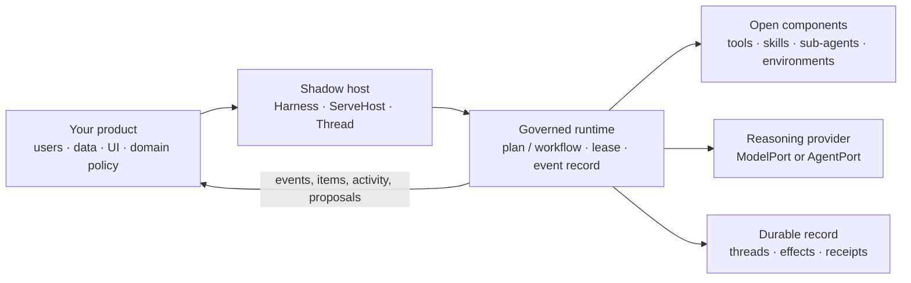

# Shadow HDK

**Shadow HDK is a Harness Development Kit for building durable, governed agent systems.**

It gives a product team the parts and boundaries needed to compose an agent, a deterministic
workflow, or a hybrid of both—without making Shadow responsible for the product's users, domain
model, data, UI, or policy decisions.

Use it when you want an agent system whose tools, environments, authority, state, and observable
history are explicit and controllable. Start with the shipped `Harness` and `ServeHost` facade, or
drop to ports and runtime primitives when your product needs to own more of the design.

```bash
pip install shadow-hdk
```

```python
from shadow_hdk.serve import Harness

async with Harness.load("harness.toml") as harness:
    async for part in harness.turn("add a .gitignore and run the tests"):
        print(part.kind, part.item.component if part.item else "")
    print(harness.thread.record.turns[-1].text)
```

`turn()` yields every part of what happens, in order: the record's events by their own kind,
`activity` beside them as it streams, `item` as each step folds closed, and `turn` — last — with
the record. The suite runs these lines as printed, against the `harness.toml` below.

`shadow-hdk` is MIT licensed, requires Python 3.12+, and is published as
[`shadow-hdk`](https://pypi.org/project/shadow-hdk/).

---

## What Shadow HDK is

Shadow HDK is a **construction kit with progressive levels of control**:

| Start here | Use it when | You control |
|---|---|---|
| `Harness` | you want a configured, in-process harness | configuration, tools, modes, policies, and product integrations |
| `ServeHost` / `shadow-hdk serve` | your product talks to an agent service, possibly from another language | deployment, authentication, product backend, and wire client |
| `Thread` / `Conversation` | you want durable or provider-owned conversations inside your application | UI, product records, lifecycle, and host ports |
| `run()` and ports | you are building a custom workflow or substrate | the entire composition, policy, state, and adapters |

These are layers of the same system, not competing products. A product can begin with the facade
and replace or supply individual pieces as it needs more control.

Shadow HDK can power:

- a ready-to-configure coding or research agent;
- a multi-step workflow with fixed discovery, validation, and reporting phases;
- an agent that plans dynamically, chooses tools, delegates to sub-agents, and creates work at
  runtime;
- a product backend that exposes governed threads to a web, desktop, or TypeScript client;
- an internal platform where each team composes its own tools, policies, models, environments, and
  storage.

The curated, ready-made **Shadow Harness** is the next product layer on the roadmap. v0.30.0
already includes the reusable `Harness` and `ServeHost` facades; it does **not** pretend that one
preconfigured workflow or policy fits every product.

## What Shadow HDK is not

Shadow HDK is not:

- a product-specific agent, SaaS, database schema, user-management system, or UI;
- a framework that decides what your domain terms, permissions, or business rules mean;
- a claim that every sandbox is fully contained, every provider is controlled, or external effects
  are exactly once;
- a replacement for your authentication, tenancy, audit, product data, or human approval process.

Those boundaries are intentional. Shadow supplies the mechanisms; your product supplies the
meaning and the authority.

---

## The design in one picture



The runtime sits between a product and an open set of components. It does not need to know the
names of your business objects. It knows what a proposed operation can do, whether the current
host permits it, how to run it, and how to record what happened.

## Core principles

### 1. Govern effects, not tool names

Policies evaluate a component's declared effect profile—what it may read, write, reach, spend,
reverse, or contain—rather than a fixed allow-list of tool names. New components can enter the
registry without silently bypassing a name-based policy.

```python
from shadow_hdk.kernel import EffectProfile, ScopeSet

profile = EffectProfile(
    reads=ScopeSet.of("workspace"),
    writes=ScopeSet.of("workspace"),
    reaches=False,
    reversible=False,
    contained=True,
    costs=False,
)
```

### 2. Separate mechanism from product policy

Shadow owns the execution mechanism: composing work, checking a lease, judging a proposed effect,
calling a component, handling interruptions, and emitting the record. The product owns its
identity, tenancy, permissions, domain data, UI, approval experience, and business policy.

This is dependency inversion in practical form: the kit depends on ports, while the product chooses
or implements adapters behind those ports.

### 3. Compose from primitives, then use presets

The public surface is deliberately progressive:

- **Primitives:** ports, components, effect profiles, compositions, leases, stores, and events.
- **Composed building blocks:** `Thread`, `Conversation`, `Harness`, `ServeHost`, modes, rules,
  environments, provider definitions, and reusable agent patterns.
- **Ready-to-configure entry points:** `harness.toml`, the `shadow-hdk serve` command, and shipped
  integrations.

You can use a conventional sequential workflow, a model-driven agent, an orchestrator with
sub-agents, or a hybrid. A workflow may contain model reasoning; an agent may construct a workflow
at runtime. The governance and record boundary remain the same.

### 4. One durable agent surface

A model API and a resident agent CLI are alternatives behind one `Thread` lifecycle. Both can use
the same tools, governance, leases, interruptions, parked questions, usage accounting, activity,
and item projection. Supply either a `ModelPort` or an `AgentPort`; do not create separate product
lifecycles merely because the reasoning source differs.

### 5. Capability claims need evidence

Providers and environments report typed capabilities and their evidence. A host can declare
`ExecutionRequirements` before it opens an agent or thread. Unknown is not silently treated as
safe: it cannot satisfy an explicit requirement.

This allows a production host to ask for properties such as a controlled tool path, resumable
sessions, live streaming, workspace-confined writes, or denied network access—and receive a
complete typed incompatibility report if the current configuration cannot prove them.

### 6. Authority is checked at the act

For a controlled irreversible effect, Shadow uses this transaction:

```text
stage → authorize → re-read current authority → executing → invoke → reconcile
```

The authorization binds the exact staged effect, the authority revision, run and step, expiry, and
idempotency key. A durable append-only journal records the outcome. After a crash, an unfinished
non-idempotent call becomes `unknown`; it is never blindly retried.

This is intentionally not an exactly-once promise for an external system. Stronger delivery
semantics require the component's own idempotency and reconciliation evidence.

### 7. Durable records and live activity are different

Threads and turns produce an ordered durable record. That record folds into renderable `Item`s.
Live reasoning, partial text, and command output travel as ephemeral activity alongside it. Clients
can reconnect to the stream without treating temporary activity as durable truth.

---

## Choose a way in

### A configured harness

For an application that wants a fast, conventional start, configure a harness and keep the
underlying objects available for later customization.

```toml
# harness.toml
[environment]
root = "."
mode = "workspace-write"

[provider]
want = ""                 # first ready provider, or claude-code / codex / opencode

[store]
path = "shadow.sqlite"    # durable threads, parked work, registries, and effect journal

[budget]
steps = 200
seconds = 1800
```

```bash
shadow-hdk serve harness.toml --http --port 8765
```

Use a private `--token-file` or `SHADOW_HDK_TOKEN` for a non-loopback HTTP listener. The
`--token` flag is deliberately only a local-development fallback.

### A product-owned integration

Use `Thread` when you want the kit's durable agent record in-process, `Conversation` when the
product owns the conversation record, or `run()` when you want a deterministic workflow from
first principles. The [consumer guide](docs/consuming.md) explains the ownership boundary and the
four entry points in detail.

### A custom workflow with no model

Shadow is a governed workflow runtime before it is an agent runner. A workflow may run with no
model at all:

```python
from shadow_hdk.adapters.basic import AllowAll, CallableComponents, StdoutSink, SystemClock
from shadow_hdk.kernel import Binding, Ceiling, Composition, EffectProfile, Floor, Invoke, Lease
from shadow_hdk.runtime import Ports, RunOptions, run


def greet(name: str) -> str:
    return f"hello, {name}"


async def main() -> None:
    tools = CallableComponents()
    tools.add(greet, effects=EffectProfile())
    ports = Ports(
        model=None,
        components=(tools,),
        governance=AllowAll(),
        sink=StdoutSink(),
        clock=SystemClock(),
    )
    plan = Composition((Invoke("say-hello", "greet", (Binding("name", value="world"),)),))
    options = RunOptions(lease=Lease(Ceiling(max_steps=100, max_wall_seconds=60), Floor(0)))

    async for event in run(plan, ports, options=options):
        print(event.kind, getattr(event, "step", ""))
```

---

## Providers, tools, skills, and environments

### Reasoning providers

Use a `ModelPort` for a model API (the LangChain adapter supports the providers LangChain
integrates) or an `AgentPort` for an installed, signed-in agent such as Claude Code, Codex, or
OpenCode. Shadow does not read, forward, or log a subscription provider's credentials; it asks the
provider for its status and uses the provider's own authenticated installation.

For a resident CLI, Shadow supplies the run's governed registry and refuses its native tool path
where a controlled adapter supports that boundary. Provider capability evidence tells the host what
is actually known—not what marketing or a wrapper name suggests.

### Components and skills

Components can be Python callables, MCP tools, environment operations, devices, sub-agents, or
your own adapter. Skills and agent patterns are data-driven building blocks. They can be selected
as presets, extended, or replaced; the runtime does not force a single agent pattern.

### Environments

An environment is also an evidence-bearing capability boundary. For example, the measured macOS
workspace mode confines writes to the workspace and denies network access, but does **not** claim
to confine reads or deny ambient secrets. A production host should require only properties it truly
needs and let Shadow refuse a configuration that cannot establish them.

---

## Protocol and clients

`ServeHost` exposes the same durable thread surface over JSON-RPC, with SSE activity and reconnect
support for HTTP. The generated TypeScript client lives in
[`clients/typescript`](clients/typescript/README.md).

v0.30.0 uses **wire protocol v3**. Version 1 and 2 clients are refused during initialization.
Regenerate or upgrade clients before connecting. See the
[v0.30 migration guide](docs/migrations/0.30.md) for the exact contract changes, and the
[v0.31 migration guide](docs/migrations/0.31.md) for what Phase 36 adds to the same protocol.

```ts
import { HarnessClient } from "shadow-hdk-client";

const client = new HarnessClient({ address: "http://127.0.0.1:8765" });
await client.connect();
const started = await client.thread.start({}); // root and mode from harness.toml; or pass them
client.approvals.onRequest((request) => client.approvals.answer(request.handle, { kind: "approve" }));
for await (const line of client.turn.start(started.thread_id, "hello from typescript")) {
  if (line.kind === "item") console.log(line.item.step, line.item.outcome);
  if (line.kind === "activity") process.stdout.write(line.activity.text);
  if (line.kind === "done") console.log(line.turn.text);
}
```

The suite drives exactly these calls against a live `serve --http` and type-checks the snippet
against the client as it is.

---

## Architecture guarantees and limits

| Shadow guarantees | Shadow deliberately does not claim |
|---|---|
| a policy decision before each governed component invocation | that a component's declaration is true without evidence |
| durable thread, turn, item, and effect records when configured with durable stores | that every deployment has the same isolation properties |
| explicit capability mismatch when stated requirements cannot be met | that unknown capabilities are safe |
| authorization bound to a particular controlled irreversible act | exactly-once completion in an external system |
| reconnectable bounded event replay | durable storage of transient activity |
| product-owned ports and open component registries | ownership of a product's users, data, schema, or UI |

Read the [architecture overview](specs/architecture/overview.md) for the durable design and the
[package guides](docs/packages/) for each module's public seam.

## Project layout

```text
src/shadow_hdk/kernel       pure contracts, effect profiles, and ports
src/shadow_hdk/runtime      execution, threads, lifecycle, records, and stream sessions
src/shadow_hdk/serve        Harness, ServeHost, CLI, configuration, and app-server boundary
src/shadow_hdk/providers    discovery and evidence-backed provider definitions
src/shadow_hdk/wire         protocol, schemas, and HTTP/stdio transport
src/shadow_hdk/adapters     implementations for models, agents, MCP, environments, storage, and more
clients/typescript          generated schemas and TypeScript client
docs/                       migration, consumer, and package-specific guides
examples/                   runnable reference integrations
```

The dependency direction is intentional: **kernel ← runtime ← adapters**. The runtime does not
import adapters, adapters do not import one another, and no product concept belongs in the kit.

## Examples and development

```bash
uv run python examples/bare.py            # model-free, product-free governed workflow
uv run python -m examples.coder ./work    # governed coding-agent example
uv run python -m examples.host "brief"    # product-owned host example
uv run python -m examples.studio ./work   # browser studio over the wire
```

For local development:

```bash
uv sync --all-extras
uv run ruff check
uv run ruff format --check
uv run mypy
uv run pytest
```

## Documentation

- [Consumer guide: choosing ownership and an entry point](docs/consuming.md)
- [For a product: what the kit answers, and how to compose it](docs/for-a-product.md)
- [v0.30 migration guide](docs/migrations/0.30.md)
- [v0.31 migration guide](docs/migrations/0.31.md)
- [Package guides](docs/packages/)
- [Architecture overview](specs/architecture/overview.md)
- [Roadmap](specs/planning/roadmap.md)
- [Changelog](specs/changelog/2026-09.md)

## Release status

**v0.31.0 — Plan admission** (Epic 0009, Phase 36) is the candidate at the release gate: a plan
an agent, a CLI or a host proposes is a composition admitted whole — shape, existence and effects
— under limits that narrow host → mode → parent, before its first step runs; `compose` is a
component a resident CLI reaches through the socket; a parked plan can be amended on the record.
See the [v0.31 migration guide](docs/migrations/0.31.md).

**v0.30.0 — Production Boundary** is released. It adds evidence-backed execution selection, one
durable model/CLI agent surface, reconnectable streaming, safer bearer configuration, and
current-authority crash-safe irreversible-effect transactions. Full details are in the
[GitHub release notes](https://github.com/avinash-singh-io/shadow-hdk/releases/tag/v0.30.0).
