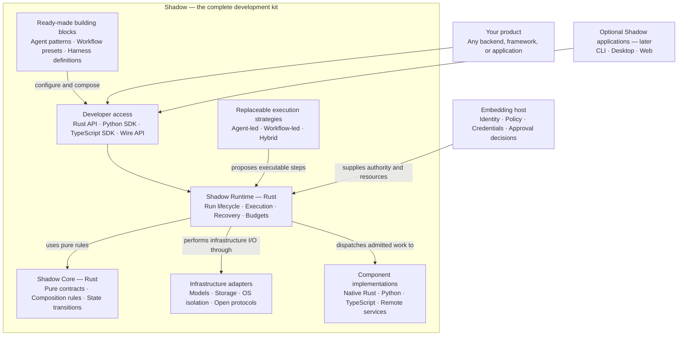
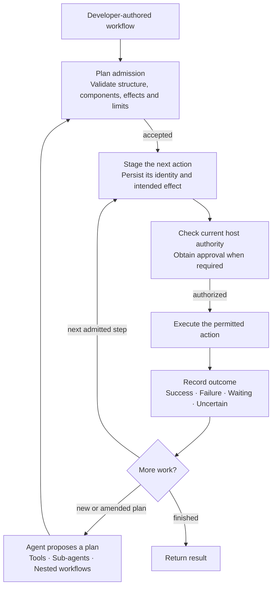

# Shadow — target native architecture

> Recorded 2026-09-21 from the owner's architecture review. **Target, not current implementation.**
> [Epic 0010](../epics/0010-cross-platform.md) owns the transition and decisions D142–D152.
> The current engine is Python/LangGraph with a Rust Linux confinement helper. No native engine,
> native SDK parity, or resource improvement is claimed by this document.

## Positioning

**Shadow is a composable framework for building and running agents, workflows and custom AI
harnesses.** Shadow is the umbrella name; a harness development kit describes its capabilities,
not a second product identity. Users can start with a ready-made assembly, configure it, compose
public components, replace behavior, or implement ports. Defaults use those same public parts.

The ready-made harness and substantial desktop/web applications remain lower priority. A generic
execution kit is not a research-specific product, an LLM, a universal sandbox, or a promise that
every optional library runs without its own dependencies.

## Overall architecture

This preserves the complete-kit diagram from the architecture discussion, with the umbrella
renamed to Shadow. Arrows are labeled interactions, not a package-import graph. The boxes are
logical boundaries: they need not be separate services or processes.

| Boundary | Owns | Does not own |
|---|---|---|
| Core, Rust | Pure contracts, composition grammar, transition rules, limit relationships | I/O, clocks, logging, frameworks, UI or product policy |
| Runtime, Rust | Admitted execution, child supervision, waiting, cancellation, resource accounting, recovery | A mandatory conversation model or a product-specific agent |
| Strategies | Planning, model/tool iteration, context preparation, workflow/hybrid behavior | Authority grants or bypasses around governed dispatch |
| SDKs | Authoring helpers, schema types, bindings/transport, managed lifecycle | Another scheduler, effect journal or recovery engine |
| Components/adapters | Useful native capabilities, model protocols, storage, component hosts, OS and standards integration | Mandatory loading of every optional ecosystem |
| Embedding host | Identity, domain data, credentials, policy and approval decisions | Altering runtime facts through unvalidated input fields |

Code dependencies remain inward: adapters and strategies implement contracts; runtime depends on
Core and ports, not concrete adapters. Composition roots assemble them. A Rust crate is compiled
code, not an additional interpreter. A component host is not automatically a security sandbox.

## Agent and workflow execution

This preserves the second discussion diagram. A workflow supplies explicit structure; an agent
proposes structure using reasoning; a hybrid includes both. Models may be called inside workflow
steps. A run need not be a conversation or a turn.

### Reading the execution diagram correctly

- It is the successful control path, not the complete state machine. Refusal invokes no refused
  action. Waiting parks; recovery reconstructs persisted state; cancellation supervises children.
- Whole-plan admission is not act-time authorization. The current Phase 36 behavior names step
  asks/refusals; it does not universally reject a plan just because one step may be refused. Phase
  46 characterizes that behavior before any deliberate contract change.
- The staged authorization transaction applies to controlled effects that require it. Observed
  external behavior is not promoted to controlled merely because a wrapper recorded a request.
- Approval is consent evidence. Current authority is checked at the actual controlled boundary;
  children can only narrow inherited authority and budgets.
- Plan amendments are new admitted revisions, not silent rewriting of completed work. Runtime
  execution state includes revision, step/attempt identity, handles, children and pending input;
  a saved transcript alone is insufficient.
- A recoverable unknown outcome needs reconciliation or an explicit host decision. No exactly-once
  guarantee is made for arbitrary external systems, and replay must not blindly repeat effects.
- Scheduling adapters later submit durable run requests; they own timing, never authority.

## Public contracts and compatibility

One versioned contract family covers definitions, registrations, compositions, observations,
requests, events and capability evidence. Wire schemas are generated and checked for drift;
SDK convenience methods are tested against the same behavioral fixtures. Equivalent behavior
does not mean deterministic LLM output or identical optional libraries in every language.

The first native delivery targets a Rust library, Python native embedding, Python/TypeScript
managed-sidecar and remote clients, and a documented wire for other languages. TypeScript native
in-process embedding is not a launch requirement. Phase 46 proves the binding approach before
its technology is locked; this document does not select UniFFI, PyO3, N-API or a C ABI by analogy.

SDKs must handle ordinary lifecycle, streaming, callbacks, cancellation and version negotiation.
The protocol client, native binding, component-authoring helper and binary launcher are distinct
support surfaces. Runtime acquisition belongs to the host/installer with pinned artifacts; an
agent cannot install a dependency or gain credentials by adding it to a plan.

## Deployment profiles

| Profile | Processes and dependencies | Required proof |
|---|---|---|
| Native standalone | Rust executable and selected native components | Useful run without Python/Node or first-run interpreter fetch |
| Embedded | Native Rust library in a supported application process | Async callbacks, cancellation, shutdown, runtime ownership and failure behavior |
| Managed sidecar | Host application plus a Rust child process | Pinned startup, compatible handshake, clean process-tree shutdown |
| Remote | Client and separately hosted runtime | Authentication, isolation/scope, reconnect and explicit availability limits |
| Optional language components | Only selected Python/Node/remote dependencies | Dependency preflight, bounded/reused hosts, disconnect and failure semantics |

A portable definition does not make a Python implementation independent of Python. A definition
describes composition; an implementation supplies code; a deployment bundle pins selected code,
definitions and runtime dependencies. Native-only usefulness must not depend on a hidden Python
worker. Local model weights and inference costs are measured separately from runtime overhead.

## Reuse and measured decisions

The [Goose comparison](../research/2026-09-21-shadow-goose-architecture.md) is evidence, not a
dependency declaration. Phase 46 evaluates selected Goose pieces against a small Shadow slice;
public contracts remain ours. No upstream fork, private API dependence or second authoritative
execution model is accepted by default. Suitable infrastructure libraries should be consumed.

Freeze representative scripted workloads, baseline measurements and acceptance budgets before
optimizing the port. Record startup, peak RSS, idle CPU, concurrency, artifact size and component
call overhead per deployment profile. Edge means an explicit supported Linux OS/architecture and
resource envelope, not every device or a microcontroller claim. No improvement is measured yet.

## Repository and rollout

The [repository proposal](../planning/shadow-repository.md) compares separate repositories with
separate branches/worktrees. After the owner's maintenance-continuity requirement, the current
recommendation is legacy `shadow-hdk` plus a new Shadow monorepo; **the choice and creation remain
pending**. Existing source paths, imports, package names, remotes and releases stay unchanged.
Native phase ownership must be settled before Phase 46 starts; the architecture itself is unchanged.

Maintain the stable Python engine during development. New native runs and old checkpoint formats
must be identifiable; no destructive conversion or silent fallback. Phase 52 supplies the parity,
old-run drain/compatibility strategy and rollback evidence before native becomes the default.
Do not execute a real irreversible workload twice for a differential comparison.

## Reading order

1. This target architecture and its two diagrams.
2. [Epic 0010](../epics/0010-cross-platform.md): decisions, proof gate and native migration.
3. [Phase map](../planning/phase-map.md): current numbers, old aliases and dependencies.
4. [Roadmap](../planning/roadmap.md): subsequent reusable harnesses and scheduling.
5. [Current implementation](overview.md): the Python/LangGraph system being migrated.
