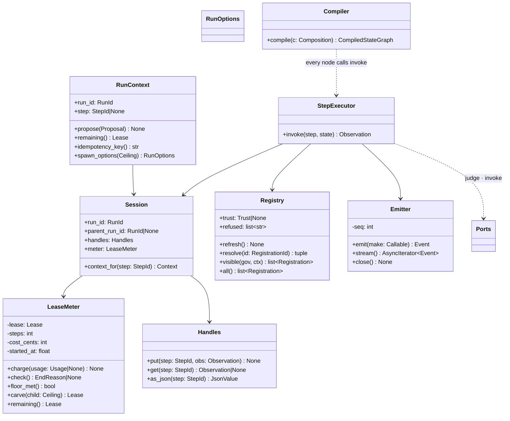

# The runtime — low-level design

> Package `shadow-hdk`, import `shadow_hdk.runtime`. Depends on `shadow_hdk.kernel` and
> LangGraph. Imports no adapter, ever.

## The public surface — four names

```python
async def run(
    composition: Composition,
    ports: Ports,
    *,
    options: RunOptions,
) -> AsyncIterator[Event]:
    """Execute a composition. Yields every event as it happens; also feeds the observer port.

    Never raises for anything a component did — a component's exception is a Failed observation.
    Raises only if a *port* fails, and even then the stream ends with Ended(reason="failed") first.
    """


async def resume(
    run_id: RunId,
    answer: Judgement | JsonValue,
    ports: Ports,
    *,
    options: RunOptions,
) -> AsyncIterator[Event]:
    """Continue a run parked on an Ask or an Await. Requires a checkpointer in options."""


def current_run() -> RunContext | None:
    """The ambient run, if this code is executing inside a step. How a component proposes,
    reads its remaining lease, and spawns children (D2)."""


@dataclass(frozen=True)
class Ports: ...


@dataclass(frozen=True)
class RunOptions: ...
```

That is the whole API. Everything else in the package is internal.

## Types

```python
@dataclass(frozen=True)
class Ports:
    model: ModelPort
    components: tuple[ComponentPort, ...]  # the registry is their union
    governance: GovernancePort
    sink: SinkPort
    observer: ObserverPort | None = None  # D6 — optional; run() always yields
    clock: ClockPort = SystemClock()  # D8 — a real default, replaceable for replay


@dataclass(frozen=True)
class RunOptions:
    lease: Lease
    context: Mapping[str, JsonValue] = frozendict()  # opaque to the runtime; the adapter reads it
    principal: str | None = None
    checkpointer: BaseCheckpointSaver | None = None  # None → InMemorySaver, no durability
    run_id: RunId | None = None  # None → clock.new_id()
    parent: RunContext | None = MISSING  # MISSING → ambient (D2); None → explicitly root
```

## Class diagram



## Modules

| module | holds |
|---|---|
| `__init__.py` | `run`, `resume`, `current_run`, `Ports`, `RunOptions`, `RunContext`, `Trust` |
| `bindings.py` | `Ports`, `RunOptions`, `RunContext`, the contextvar (D2); `executing(step)` — the scope within which `current_run().step` is set, the component's invoke only; `spawn_options` — a child inherits its parent's context attributes (thread, turn, mode) unless handed its own (D74, BUG-030) |
| `session.py` | `Session`, `LeaseMeter`, `Handles` |
| `emit.py` | `Emitter` — seq, clock stamp, queue, observer task; `activity`/`forward_activity` — what is happening, beside the record (D63): to an `ActivityObserver` if one listens, up to the parent if a child, dropped-oldest, never on the stream `run` yields |
| `registry.py` | `Registry` — union of component ports, `resolve`, `visible`; with a `Trust`, a driver that cannot prove itself is refused at `refresh` — absent, reason in `refused` (D27) |
| `trust.py` | `Trust(keys, revoked, must_sign)`, `sign`, `verify`, `signing_bytes` — HMAC-SHA256 over the registration's canonical form minus the signature (D27) |
| `acting.py` | `exhausted(lease)`, `grounds(context, argv=, warrant=)` — what a driver reads at the moment of the act and what its `Acted` receipt carries (R9); the warrant is carried, not judged (ADR-1) |
| `inputs.py` | `resolve_inputs(bindings, handles) -> JsonValue`; `DanglingRef` |
| `step.py` | `StepExecutor.invoke` — the seven moves; a component answering `Asked` parks the run and is resumed with the answer and what it kept (D57) |
| `compile.py` | `compile_composition`; the structural-hash cache (D11) |
| `state.py` | `RunState` TypedDict and its reducers |
| `loop.py` | `run`, `resume` — Started … Ended, end reasons, child forwarding |
| `errors.py` | `RuntimeStop` and its three — `LeaseExhausted`, `Cancelled`, `PortFailure` — plus `DanglingRef`. **A stop is a `BaseException`** (TD-006): every component adapter catches `Exception`, and it should, so a stop that was one got swallowed by whatever component was running |
| `cancel.py` | the handle a host keeps and the check a step makes (D15) |
| `approvals.py` | the other handle a host keeps: a component requests approval — or the person's input — **live** while its step runs, because a step holding a provider's session cannot park (D58); answered `Approve`, `Deny` or `ApproveAndAddRule` (D61) |
| `children.py` | what a run is holding — spawn · send · release, and the records that survive a park (D16, D37); `Narrowed`, the pattern's ceiling applied as a second gate where the child is spawned, whichever side of the wire (D51) |
| `clock.py` | `SystemClock` — moved here from `adapters/basic` so the wire needs no adapter (TD-003) |
| `devices.py` | the device contract: `Sensor` · `Actuator` · `Witness` · `Reading` · `Ack` · `Overheard` (D31), below every protocol adapter so none imports another |
| `leash.py` | a program run under limits, and the process tree it starts killed with it (D35) |
| `environment.py` | an environment has a mode and a workspace: `Isolation`, `Mode`, the one derivation `effects_of`, the `Environment` base (D48); one or many roots, `inside()` by the root-name rule, `reopen` on a new workspace or mode — proven again, refused unchanged (D76, D77) |
| `offer.py` | the run's registry offered to an agent that owns its own loop (D42, D62): one call routed as a child run under a carved ceiling, judged, recorded, the policy's question put to the host live; `InProcessOffer` for an agent in this process, the recording adapter's `SocketOffer` in front of it for a CLI; `changed()` tells a resident agent its catalogue changed (`tools/list_changed`, BUG-032) |
| `conversation.py` | `Conversation` — the governed turn as a primitive (D87): one provider session on the served registry, `turn(text, when=, on_question=)` as a run of one step streamed as events, `last` what it came to (`Turned`), `tools()`, `set_mode`, `add_root`, `steer`, `interrupt`; no record — a product that keeps its own takes this alone. A question a turn parks on purpose (`Parked`, D88) stays on `last.pending` for whoever keeps the record |
| `threads.py` | `Thread` — a `Conversation` with a record: the container every product has (D62): a provider opened once and held across turns, resumed on its own session id when reopened (D76), the registry served for its lifetime under the host's name, each turn its own run; `set_mode` (policy, then the environment follows, then the provider — D64, D76), `add_root`, `tools()` — what the agent is offered now with the mode's judgement (D73); `workspace`, `environment_mode`; `WorkspaceChanged` and `ModeChanged` announced between turns; the questions a turn is waiting on kept on the record and a turn the host died in `parked` or `cancelled` at resume, `settle` resuming the parked act from the checkpointer (D80); one holder per thread — a hold taken, renewed and released on the store, `ThreadHeld` naming another's — and `turn(when=)`: enqueue · reject · interrupt (D81) |
| `store.py` | `InMemoryStore` — the `Store` port (D66) for a process: collections of JSON rows, a version per collection |
| `switched.py` | `Switched` — a component port minus what a store's switches say is off (D66), read at every refresh; `store_switches` |
| `person.py` | `ask_person` — the agent's own question to the person as a component (D65): no effects, `InputRequested` on the record, the text through the host's handle; nobody there is a failure that says so |
| `items.py` | the event stream folded into the items a host renders — one pure fold, in-process and over the wire (D46, D61); `run_items(nested=True)` yields every item as it closes with its `parent`, so a host renders live and not when the orchestrator finishes |
| `processes.py` | starting and ending what the harness owns — `start_held` is **the one place** a session leader is started (the leash, the coding CLIs, the ACP bridge, a battery's MCP server all call it; an invariant refuses the next copy), and every one is `hold`-ed and dies with the interpreter, by whichever door (D35, D53, BUG-019, BUG-033) |
| `lines.py` | newline-delimited frames over a byte stream, one implementation (`LineBuffer`) — the wire's stdio channel and the recording adapter's pipes read by it, so a blank line or a carriage return means the same on every peer |
| `replay.py` | a recorded model port, so a run can be re-driven without paying for it |
| `testing/` | `InMemoryComponents`, `ScriptedModel`, `ListSink`, `ListObserver`, `FixedClock` (D8) |

## The governed step — the algorithm, in full

```python
async def invoke(self, step: Invoke | Await, state: RunState) -> Observation:
    # 1 — the ceiling always beats everything, including the floor
    if reason := self.session.meter.check():
        raise LeaseExhausted(reason)

    # 2 — resolve; an unknown registration is the agent's mistake, not a crash
    try:
        port, registration = self.registry.resolve(step.component)
    except KeyError:
        return await self._observe(step, Failed(f"no component registered as {step.component!r}"))

    # 3 — inputs; a dangling handle is likewise data
    try:
        inputs = resolve_inputs(step.inputs, self.session.handles)
    except DanglingRef as exc:
        return await self._observe(step, Failed(str(exc)))

    # 3½ — did this step park? then resume it where it parked, and nowhere earlier (D38)
    if (parked_on := self._resuming.pop(step.id, None)) is not None:
        return await self._resume_where_it_parked(step, parked_on, port, registration, inputs)

    # 4 — judge, over effects, never over the name
    ctx = self.session.context_for(step.id)
    judgement = await self._port(self.ports.governance.judge, registration.component.effects, ctx)
    match judgement:
        case Refuse(reason):
            await self.emit(lambda **k: RefusedEvent(step=step.id, reason=reason, **k))
            return await self._observe(step, Refused(reason), emit=False)
        case Ask(question):
            handle = f"{self.session.run_id}:{step.id}"
            await self.emit(lambda **k: ApprovalRequested(step=step.id, question=question, handle=handle, **k))
            answer = _as_judgement(interrupt({"run_id": …, "step": step.id, "question": question}))
            if not isinstance(answer, Allow):
                reason = getattr(answer, "reason", "not allowed")
                return await self._observe(step, Refused(reason))

    # 5 — invoke; an Await simply does not resume until the host answers
    await self.emit(lambda **k: Invoked(step=step.id, component=registration.id, inputs=inputs, **k))
    try:
        observation = await port.invoke(registration.id, inputs)
    except Exception as exc:                                   # D7 — a component is untrusted
        observation = Failed(f"{type(exc).__name__}: {exc}")

    # 6 — charge, 7 — observe and store the handle
    self.session.meter.charge(self._usage_of(observation))
    return await self._observe(step, observation)
```

`self._port(...)` wraps a **port** call: an exception there raises `PortFailure`, which `loop.py`
turns into `Ended(reason="failed")` (D7).

## Compiling a composition

```python
def compile_composition(c: Composition, executor: StepExecutor, checkpointer) -> CompiledStateGraph
```

| step kind | compiles to |
|---|---|
| `Invoke` | one node calling `executor.invoke` |
| `Await` | one node whose observation may be `Pending`; the parked form is `interrupt()` |
| `Sequence` | its children as nodes, wired with edges in order |
| `FanOut` | a dispatcher node returning `[Send(child, …) for child in steps]`, and a join node |
| `Until` | the body as a node, plus a conditional edge on `(condition satisfied) or (iterations ≥ max)` |
| a nested composite | a **subgraph** node with its own checkpoint namespace |

```python
class RunState(TypedDict):
    handles: Annotated[dict[StepId, JsonValue], merge_dicts]
    observations: Annotated[dict[StepId, Observation], merge_dicts]
    iterations: Annotated[dict[StepId, int], merge_counts]
```

Reducers are commutative because `FanOut` writes concurrently — that is why they are dicts keyed by
step id rather than lists.

**The cache (D11).** `compile_composition` is memoised on the composition's structural hash: the same
shape, however often an agent re-authors it, compiles once per process.

## The drive

```python
async def run(composition, ports, *, options):
    parent = _resolve_parent(options)  # D2
    session = Session.open(options, parent, clock=ports.clock)
    emitter = Emitter(session.run_id, ports.clock, ports.observer)
    token = _CURRENT.set(RunContext(session, emitter, ports))
    try:
        await emitter.emit(Started(lease=session.meter.lease, parent_run_id=session.parent_run_id))
        if parent:
            await parent.emit(Spawned(child_run_id=session.run_id, lease=session.meter.lease))
        await emitter.emit(Composed(composition=composition))
        graph = compile_composition(
            composition,
            StepExecutor(session, emitter, ports),
            options.checkpointer or InMemorySaver(),
        )
        reason = "completed"
        try:
            async for _ in graph.astream(
                {...}, config={"configurable": {"thread_id": session.run_id}}
            ):
                pass
        except LeaseExhausted as exc:
            reason = exc.reason
        except Cancelled:
            reason = "cancelled"
        except PortFailure:
            reason = "failed"
        await emitter.emit(Ended(reason=reason, steps_taken=session.meter.steps))
        async for event in emitter.stream():
            if parent:
                await parent.forward(event)  # D2 — children stream through parents
            yield event
    finally:
        _CURRENT.reset(token)
        emitter.close()
```

**End reasons.** `completed` · `lease_exhausted` · `gave_up` (the agent declared unfinishable *after*
the floor) · `cancelled` · `failed`.

## Sequence — a governed step with an Ask, then a resume

```
agent adapter ──run()──► Emitter          Started, Composed
run           ──────────► StepExecutor    invoke(step)
StepExecutor  ──────────► GovernancePort  judge(effects, ctx) → Ask("may it reach the network?")
StepExecutor  ──────────► Emitter         Asked            ──► observer / iterator
StepExecutor  ──────────► LangGraph       interrupt()      ──► checkpoint under thread_id = run_id
   ⟨ the process may end here ⟩
host          ──resume(run_id, Allow())─► LangGraph        Command(resume=Allow())
   ⟨ LangGraph re-runs the node from the top; the checkpoint's pending interrupts say this
     step parked and on what, so it is NOT judged again and lands back at its interrupt (D38) ⟩
StepExecutor  ──────────► ComponentPort   invoke           → Completed
StepExecutor  ──────────► Emitter         Invoked, Observed        ⟨ once, not twice ⟩
run           ──────────► Emitter         Ended(completed)
```

**The answer decides, so it must be a judgement.** `resume` takes an `Allow` or a `Refuse` — the
object in process, its JSON over the wire, loaded at the runtime's edge like everything else that
crosses (D19). A bare value is refused rather than read as consent nobody gave. One answer settles
every step parked in that superstep, which is what a `FanOut` of two Asks needs; an answer keyed by
step id (`{"s2": Allow()}`) addresses them one at a time.

## Sequence — a sub-agent, carved and forwarded

```
parent run  ── step: Invoke(agent_component) ──► AgentComponent.invoke
AgentComponent ── current_run() ──► RunContext(parent)
AgentComponent ── run(child_composition, ports, options=ctx.spawn_options(ceiling)) ──►
    child Session ── meter carved from parent's remaining ──► parent debited
    parent Emitter ◄── Spawned(child_run_id, lease)
    child  Emitter ── Started(parent_run_id=parent) … Ended ──► forwarded into parent's stream
AgentComponent ◄── child observations ──► Completed({"text": …, "proposals": n})
```
